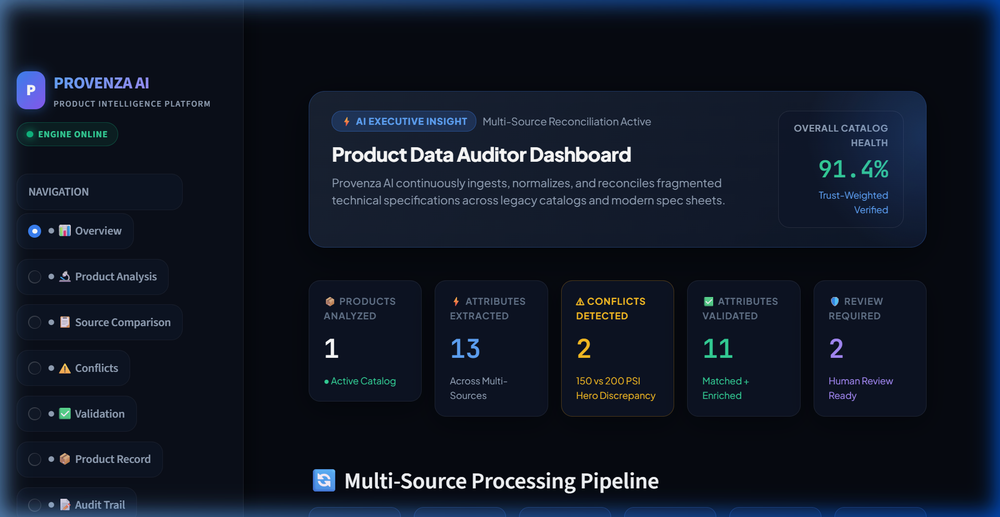
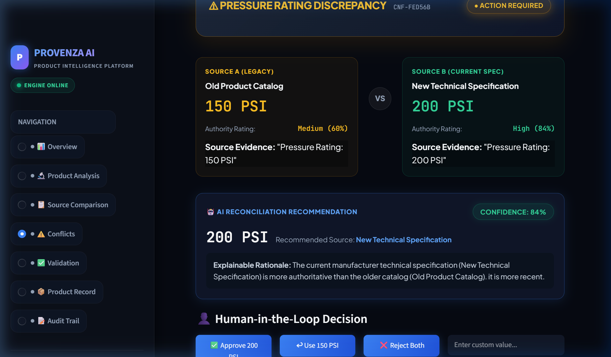

# PROVENZA AI — AI Product Data Auditor

> **TAGLINE:** *"We don't just extract product data — we make it trustworthy."*

[](https://www.python.org/)
[](https://streamlit.io/)
[](https://ai.google.dev/)
[](LICENSE)

---

## 🎯 Hackathon Challenge & Vision

**Challenge:** *AI-Powered Product Intelligence for Industrial Commerce*

Industrial manufacturers manage product information across websites, legacy PDF catalogs, technical datasheets, spreadsheets, and engineering documents. This leads to fragmented, outdated, and conflicting product data across sales channels.

### The Provenza AI Difference:
- **A Normal AI System says:** *"Here is the product data."*
- **Provenza AI says:** *"Here is the product data, here is where every value came from, here is the evidence, here is how confident we are, here are the conflicts, and here is why this value was selected."*

---

## 📸 Core Product Demonstration

### 1️⃣ Executive Governance Dashboard
*Real-time catalog health metrics, 6-step processing pipeline status, and interactive Plotly trust distribution charts.*



### 2️⃣ Hero Innovation: Transparent Conflict Detection & Human-in-the-Loop
*Never silently overwrites data. Displays side-by-side visual diff cards with explainable AI rationales and 1-click human review buttons.*



---

## 🛠️ Key Architectural Innovations

1. **📄 Multi-Source Ingestion Engine:**
   - Supports PDFs (`pdfplumber` + `PyMuPDF`), CSV, XLSX, and TXT datasheets.
   - Preserves source metadata, authority levels, and publication recency dates.

2. **🧠 Hybrid Extraction Engine (Gemini 2.0 Flash + Deterministic Fallback):**
   - Leverages Google Gemini 2.0 Flash for structured JSON extraction.
   - Includes a zero-dependency local heuristic rule parser that operates 100% offline without API keys.

3. **📏 Industrial Unit & Material Normalization:**
   - Normalizes numerical units (`PSI`, `bar`, `inch`, `mm`, `°F`, `°C`).
   - Standardizes materials (e.g., `SS304` / `Stainless 304` ➔ `304 Stainless Steel`).

4. **🔍 Multi-Tier Product Matching:**
   - Combines exact SKU matching, fuzzy Levenshtein similarity, and Sentence-Transformers semantic embeddings.

5. **⚖️ Deterministic Trust Scoring Model (No Black-Box Guessing):**
   $$\text{Trust Score} = 0.35 \times \text{Authority} + 0.25 \times \text{Recency} + 0.20 \times \text{Evidence} + 0.10 \times \text{LLM Conf} + 0.10 \times \text{Agreement}$$

6. **👤 Human-in-the-Loop Decision Toolbar:**
   - One-click review actions (`Approve Recommendation`, `Use Legacy Value`, `Reject Both`, `Custom Override`).

7. **📝 Immutable Compliance Audit Trail:**
   - Chronological lineage logging of every attribute change, source attribution, and reviewer decision for enterprise compliance.

8. **📦 Commerce-Ready Export:**
   - 1-Click JSON and CSV exports formatted for Shopify, SAP ERP, Salesforce Commerce Cloud, and PIM platforms.

---

## 💡 Hero Demonstration Scenario

| Attribute | Source A (2003 Legacy Catalog) | Source B (2026 Tech Spec Sheet) | Provenza AI Decision | Confidence |
|---|---|---|---|---|
| **SKU** | `SS-304-V2` | `SS-304-V2` | `✓ MATCH` | 99% |
| **Material** | `304 Stainless Steel` | `304 Stainless Steel` | `✓ MATCH` | 99% |
| **Pressure Rating** | `150 PSI` *(Older)* | `200 PSI` *(Current)* | `⚠ CONFLICT ➔ 200 PSI` | 84% |
| **Bore Type** | *Not Specified* | `Full Bore` | `+ ENRICHED` | 88% |

---

## ⚡ Quick Start & Installation

### Prerequisites:
- Python 3.11+
- Git

### 1. Clone Repository:
```bash
git clone https://github.com/GVethaNarayanan/Provenza-AI.git
cd Provenza-AI
```

### 2. Install Dependencies:
```bash
pip install -r requirements.txt
```

### 3. Environment Configuration:
Create a `.env` file in the root directory:
```env
GEMINI_API_KEY=your_gemini_api_key_here
DEMO_MODE=true
LOG_LEVEL=INFO
```
*(Note: If no API key is provided, Provenza AI automatically uses its built-in offline heuristic engine.)*

### 4. Launch the Dashboard:
```bash
python run.py
```
Open your browser at: **`http://localhost:8501`**

---

## 📂 Project Structure

```
Provenza-AI/
├── app/
│   ├── config.py                 # Configuration & Authority Weights
│   ├── models/                   # Pydantic Schemas (Source, Attribute, Conflict, Record)
│   ├── ingestion/                # PDF, CSV, XLSX, and TXT Parsers
│   ├── extraction/               # Gemini LLM Extractor & Heuristic Fallback
│   ├── normalization/            # Unit, Attribute, and Material Normalizers
│   ├── matching/                 # SKU, Fuzzy, and Embedding Product Matchers
│   ├── reconciliation/           # Reconciliation Engine & Conflict Detector
│   ├── storage/                  # In-Memory Database Store
│   ├── export/                   # Commerce JSON/CSV Exporters
│   └── demo/                     # Pre-loaded Hero Demo Scenario
├── ui/
│   ├── app.py                    # Main Streamlit Router & Navigation
│   ├── styles.py                 # Enterprise Glassmorphic Theme CSS
│   └── pages/                    # 7 Dashboard Pages (Overview, Analysis, Conflicts, etc.)
├── docs/
│   └── images/                   # Clean Documentation Screenshots
├── tests/                        # 39 Unit & Integration Tests
├── run.py                        # Application Entry Point
└── requirements.txt              # Dependencies
```

---

## 🧪 Testing & Verification

Run the full automated unit test suite:
```bash
python -m pytest tests/ -v
```
*(39 out of 39 tests passing)*

---

## 📜 License

Distributed under the MIT License. See `LICENSE` for more information.

---

**Made with ❤️ for Industrial Commerce Intelligence.**
